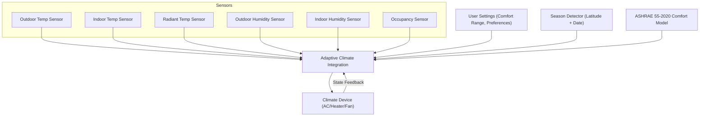
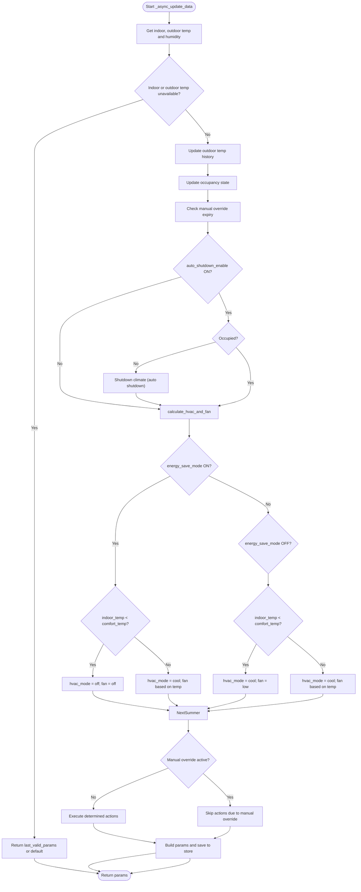

# Adaptive Climate
[](https://github.com/hacs/integration)
[](https://github.com/msinhore/adaptive_climate/actions/workflows/ci.yml)
[](https://github.com/msinhore/adaptive_climate/releases)
[](https://github.com/msinhore/adaptive_climate/releases)
[](https://github.com/msinhore/adaptive_climate/stargazers)
[](https://github.com/msinhore/adaptive_climate/blob/main/LICENSE)
[](https://github.com/msinhore/adaptive_climate)


A Home Assistant integration that implements ASHRAE 55 Adaptive Thermal Comfort standards for intelligent climate control.


## What it does

Adaptive Climate intelligently manages your climate system using a scientific, adaptive approach. It:

- Continuously monitors indoor temperature, outdoor temperature, radiant temperature (if available), humidity, and occupancy sensors.
- Detects the current season based on your latitude and date, adapting comfort logic for summer, winter, spring, and autumn.
- Uses user-configurable minimum and maximum comfort temperature ranges.
- Applies the ASHRAE 55-2020 Adaptive Thermal Comfort model to determine the optimal comfort zone for your environment.
- Automatically sets your AC or heater to the most appropriate mode (cool, heat, fan, dry, or off) to maintain comfort and save energy.
- Dynamically controls fan speed (air velocity) to improve comfort, even without changing the setpoint temperature.
- Supports **energy save mode**: disables HVAC when indoor temperature is below comfort temperature in summer for energy savings.
- Supports **auto shutdown**: turns off the climate system if no occupancy is detected for a configurable time.
- Supports **manual override** with expiry: maintains a user-set temperature for a period before returning to automatic mode.
- Integrates all available sensor data (temperature, humidity, radiant temperature, occupancy, etc.) for precise, science-based comfort decisions.
- Stores running mean outdoor temperature history for accurate adaptive calculations.
- When **user manual override** mode is enabled, any manual change to the climate entity (hvac mode, temperature, or fan mode) will pause automatic control.
- Ensures all actions are based on international comfort standards, not just fixed setpoints.

Instead of fixed temperature setpoints, Adaptive Climate adapts to weather, season, and occupancy to improve comfort and reduce energy consumption, providing a truly intelligent and scientific climate control experience.

## Problem it solves

Traditional thermostats use static temperature settings that don't account for:

- Seasonal adaptation (people feel comfortable at different temperatures in summer vs winter)
- Outdoor temperature influence on comfort perception
- Energy waste from over-heating or over-cooling
- Lack of scientific basis for temperature choices

## How it works

The integration:

1. Monitors indoor and outdoor temperatures, humidity, occupancy, and optional radiant temperature.
2. Calculates adaptive comfort zones using ASHRAE 55 standards and pythermalcomfort.
3. Provides real Home Assistant entities to control and monitor your climate system:
   - Binary sensor: ASHRAE compliance
	- **Select entity:** Comfort category (I, II, III)
	- **Number entities (8):** min/max comfort temps, air velocity, temperature change threshold, natural ventilation threshold, setback offset, auto shutdown minutes
	- **Switch entities (4):** energy save mode, natural ventilation enable, auto shutdown enable
4. Suggests optimal HVAC modes (heating, cooling, fan only, dry, humidify, off) based on real comfort science.
5. Tracks compliance with international comfort standards.

## Installation

### Via HACS (Recommended)

1. Install [HACS](https://hacs.xyz/) if not already installed
2. Go to HACS → Integrations → ⋮ → Custom repositories
3. Add this repository URL and select "Integration"
4. Install "Adaptive Climate"
5. Restart Home Assistant
6. Go to Settings → Devices & Services → Add Integration → "Adaptive Climate"

### Manual Installation

1. Download the latest release
2. Extract to `custom_components/adaptive_climate/` in your HA config directory
3. Restart Home Assistant
4. Add via Settings → Devices & Services → Add Integration

## Configuration

### Required

- **Climate entity**: Your AC/heating system (e.g., `climate.living_room`)
- **Indoor temperature sensor**: Room temperature (e.g., `sensor.living_room_temperature`)
- **Outdoor temperature sensor**: Outside temperature (e.g., `sensor.outdoor_temperature`)

### Optional

- Indoor/outdoor humidity sensors
- Occupancy sensor
- Mean radiant temperature sensor
- Air velocity sensor

## What you get

### Information entity (1)
- ** and ASHRAE Compliance**  (binary sensor): Shows if current conditions meet comfort standards.

### Control entities
#### Number entities (8):
- Minimum Comfort Temperature
- Maximum Comfort Temperature
- if Air Velocity
- Temperature Change Threshold
- Natural Ventilation Threshold
- Setback Temperature Offset
- Auto Shutdown Minutes
- Auto Start Minutes

#### Select entity (1):
- Comfort Category (I, II, III)

#### Switch entities (4):
- Energy Save Mode
- Natural Ventilation Enable
- Auto Shutdown Enable
- Auto Start Enable

## Usage

1. **Basic monitoring**: Check the compliance sensor to see if your space is comfortable
2. **Automatic control**: Use the HVAC recommendation sensor in automations
3. **Fine-tuning**: Adjust the control entities via the device page or configuration options
4. **Energy saving**: Enable energy save mode for automatic HVAC off when comfort is met
5. **Manual override**: Set a manual temperature with expiry to temporarily override automatic control

## Automation example

```yaml
automation:
  - alias: "Adaptive Climate Control"
    trigger:
      - platform: state
        entity_id: sensor.adaptive_climate_hvac_recommendation
    action:
      - service: climate.set_hvac_mode
        target:
          entity_id: climate.living_room
        data:
          hvac_mode: "{{ states('sensor.adaptive_climate_hvac_recommendation') }}"
```

## Supported languages

English, Portuguese (Brazil), Italian, French, Spanish, German

## Technical details

- Based on ASHRAE 55-2020 Adaptive Thermal Comfort model
- Uses pythermalcomfort library algorithms for scientific accuracy
- Updates every minute or when sensor values change
- Stores 7-day outdoor temperature history for running mean calculations
- Uses CoordinatorEntity pattern for efficient data management
- Compatible with Python 3.13+ through patched implementation

## Scientific Citation

This integration implements adaptive thermal comfort calculations based on the pythermalcomfort library. If you use this integration in research or academic work, please cite:

**Tartarini, F., Schiavon, S., 2020.**  
*pythermalcomfort: A Python package for thermal comfort research.*  
SoftwareX 12, 100578.  
https://doi.org/10.1016/j.softx.2020.100578

The adaptive comfort calculations follow ASHRAE Standard 55-2020 implementations as provided by the Center for the Built Environment, UC Berkeley.

## Acknowledgments

- **pythermalcomfort**: Scientific thermal comfort algorithms ([GitHub](https://github.com/CenterForTheBuiltEnvironment/pythermalcomfort))
- **ASHRAE Standard 55-2020**: Thermal Environmental Conditions for Human Occupancy
- **CBE Comfort Tool**: Reference implementation ([comfort.cbe.berkeley.edu](https://comfort.cbe.berkeley.edu/))

## Support

- [Issues](https://github.com/msinhore/adaptive_climate/issues): Bug reports and feature requests
- [Discussions](https://github.com/msinhore/adaptive_climate/discussions): Questions and community support

## License

MIT License - see [LICENSE](LICENSE) file for details.

## Architecture Diagram


## Workflow Decision


